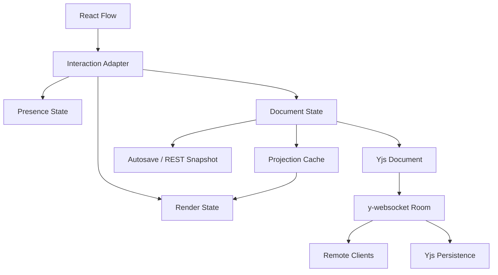

# Workflow Canvas Performance, Sync, and Collaboration Refactor Guidance

## Status

Date: 2026-05-20

This document is the implementation guidance for the next Mina workflow canvas refactor. It focuses on React Flow performance, autosave/WebSocket correctness, and the future React Flow + Yjs + y-websocket collaboration path.

The core decision is:

```text
Keep React Flow as the interaction and rendering engine.
Split high-frequency interaction state from persistent workflow document state.
Use Yjs + y-websocket for future collaborative editing, but introduce it in phases.
Do not copy Lumina as the target architecture; use it only as a comparison sample.
```

## 1. Goal

The refactor must produce a workflow canvas that:

1. Keeps node drag, selection drag, pan, and zoom responsive on ordinary and large canvases.
2. Preserves autosave, manual save, workflow versioning, and WebSocket freshness events.
3. Keeps image previews visible in canvas nodes.
4. Uses video poster/cover rendering by default and mounts playable video only after explicit user action.
5. Avoids broad React/Zustand subscriptions that cause unrelated nodes to rerender.
6. Keeps React Flow in a controlled mode where controlled state is updated correctly.
7. Provides a clear migration path to React Flow + Yjs + y-websocket collaboration.
8. Creates measurable performance targets and regression checks before large follow-up changes.

## 2. Non-Goals

This refactor must not:

1. Hide image previews during drag as the main performance solution.
2. Remove autosave, WebSocket freshness, or workflow version checks to make interaction feel faster.
3. Persist React Flow transient fields such as `selected`, `dragging`, `measured`, `positionAbsolute`, or runtime-only viewport.
4. Treat Lumina as the source of truth for Mina architecture.
5. Replace the Mina media slot model with Lumina edge binding semantics.
6. Introduce Yjs into the production save path before the current REST snapshot path is stable and measured.
7. Store media bytes, media URLs, or large task outputs inside the Yjs document.
8. Optimize by making the canvas less useful to users. User experience is the highest priority.

## 3. Reference Basis

Use these references as the external engineering baseline:

1. React Flow controlled state uses `onNodesChange` plus `applyNodeChanges()` to apply node changes to external node state: <https://reactflow.dev/api-reference/utils/apply-node-changes>
2. React Flow performance guidance recommends memoizing components, functions, `nodeTypes`, `edgeTypes`, avoiding unnecessary access to the full `nodes` array, and reducing visible node work: <https://reactflow.dev/learn/advanced-use/performance>
3. React Flow `<ReactFlow />` documents `onNodesChange` for node drag/select/move changes and `onMove` for pan/zoom changes: <https://reactflow.dev/api-reference/react-flow>
4. React Flow Collaborative example is based on React Flow + Yjs + y-websocket: <https://reactflow.dev/examples/interaction/collaborative>
5. React Flow Multiplayer guidance separates realtime actions, drag state, presence, and conflict handling concerns: <https://reactflow.dev/learn/advanced-use/multiplayer>
6. Yjs document updates are compact binary deltas and are commutative, associative, and idempotent: <https://docs.yjs.dev/api/document-updates>
7. y-websocket provides a Yjs WebSocket provider with cross-tab communication and awareness support: <https://docs.yjs.dev/ecosystem/connection-provider/y-websocket>
8. Yjs Awareness is the right place for cursor, selection, presence, and other non-persistent user state: <https://docs.yjs.dev/api/about-awareness>

Use these local documents as Mina constraints:

```text
docs/design/workflow-canvas-implementation-guidance.md
docs/design/workflow-storage-and-concurrency-refactor.md
docs/design/media-object-workflow-input-architecture.md
docs/design/task-provider-model-config-architecture.md
```

## 4. Current Mina Baseline

Current relevant frontend shape:

```text
apps/web/src/features/workflow-canvas/
  components/WorkflowCanvas.tsx
  components/WorkflowCanvasPage.tsx
  components/nodes/*
  hooks/use-workflow-autosave.ts
  react-flow/flow-adapters.ts
  react-flow/use-workflow-flow-handlers.ts
  store/canvas-store.ts
  store/canvas-ui-store.ts
  store/selectors.ts
  store/slices/*
```

Current useful facts to preserve:

1. Mina already has a native `WorkflowCanvasNode` / `WorkflowCanvasEdge` contract.
2. `WorkflowCanvasNode.data.mediaSlots` is the target node input source of truth.
3. Edges are visual and dependency projections; they must not become the only input truth.
4. Image and video generation nodes already have `mediaView`.
5. Autosave currently watches `draftRevision > savedRevision`.
6. WebSocket freshness events notify clients about workflow/task/media updates.
7. React Flow is already used through `@xyflow/react`.

Current performance and correctness risks:

1. `nodes.map(toFlowNode)` rebuilds all React Flow nodes whenever the graph array changes.
2. Passing a `runtime` object into every node's `data` can make all nodes look changed when `runningNodeId`, `runError`, or callbacks change.
3. Node components calling `useCanvasNode(id)` can be acceptable only if the selector is narrow and stable. If it scans/rebuilds from a broad graph array, many nodes rerender.
4. Dragging node positions through the same store path as persistent document changes can trigger autosave, WebSocket logic, selectors, projection, and node renders every frame.
5. Skipping drag-time `position` changes in a controlled React Flow setup can cause React Flow internal drag state and external `nodes` prop to fight each other.
6. WebSocket effects must not reconnect because dirty state, selected nodes, or version values changed.
7. Per-node `useQuery` patterns can become expensive when many visible nodes subscribe to task outputs independently.

## 5. Root Cause Model

The lag is best understood as a chain reaction:

```text
Pointer move
  -> React Flow emits NodeChange / viewport movement
  -> Mina writes to graph store
  -> graph store replaces nodes array
  -> WorkflowCanvas maps all document nodes to flow nodes
  -> every flow node gets new data/runtime references
  -> node components reselect node data
  -> autosave/dirty/WS-related subscribers observe changes
  -> React schedules more work than the frame budget allows
```

Zoom can remain smooth while drag/pan becomes slow because zoom can often stay inside React Flow's internal transform path. Node drag becomes slow when each pointer move is converted into application-level document state and broad React reactivity.

The target design removes this coupling:

```text
Pointer move
  -> React Flow emits high-frequency changes
  -> render state updates the frame immediately
  -> optional presence update is throttled
  -> persistent document state is untouched until interaction stop
  -> autosave and WebSocket run once per semantic commit
```

## 6. Target Architecture

Use four state layers.



### 6.1 Document State

Document state is the persistent workflow source of truth.

It owns:

1. Workflow id, name, version, dirty status, draft revision, saved revision.
2. Stable workflow nodes.
3. Stable workflow edges.
4. Node business data: title, node type, task config, media slots, media view.
5. Stable layout fields: position, parent, extent, width, height.

It must not own:

1. Pointer position during drag.
2. React Flow selected/dragging/measured fields.
3. Viewport movement every frame.
4. Remote collaborator cursor.
5. Temporary hover/connection UI state.

Recommended normalized shape:

```ts
interface WorkflowDocumentState {
  workflowId: string
  name: string
  version: number
  dirty: boolean
  draftRevision: number
  savedRevision: number
  nodesById: Record<string, WorkflowCanvasNode>
  nodeOrder: string[]
  edgesById: Record<string, WorkflowCanvasEdge>
  edgeOrder: string[]
  nodeVersionsById: Record<string, number>
  edgeVersionsById: Record<string, number>
}
```

Array selectors can still be exposed:

```ts
const selectDocumentNodes = (state: WorkflowDocumentState) =>
  state.nodeOrder.map((id) => state.nodesById[id]).filter(Boolean)
```

But hot paths should avoid rebuilding arrays unless the order or relevant entity versions changed.

### 6.2 Render State

Render state is the React Flow frame state.

It owns:

1. `flowNodes`.
2. `flowEdges`.
3. The latest React Flow-compatible positions during drag.
4. React Flow selection state if needed by React Flow itself.
5. Node dimension changes before they are committed into document state.

Recommended shape:

```ts
interface WorkflowRenderState {
  flowNodes: WorkflowFlowNode[]
  flowEdges: WorkflowFlowEdge[]
  flowNodesById: Record<string, WorkflowFlowNode>
  flowEdgesById: Record<string, WorkflowFlowEdge>
  interaction: {
    draggingNodeIds: Set<string>
    selectionDragActive: boolean
    viewportMoving: boolean
  }
}
```

Rules:

1. `onNodesChange` always updates render state.
2. `applyNodeChanges(changes, flowNodes)` is the default semantics.
3. Drag-time `position` changes update render state but do not mark the workflow dirty.
4. Render state does not autosave.
5. Render state can be overwritten from document projection after remote or persisted document commits, but not in the middle of a local drag without conflict handling.

### 6.3 Presence State

Presence state is collaboration/UI state that is not persisted.

It owns:

1. Local user cursor.
2. Remote user cursors.
3. Local and remote selected node ids.
4. Dragging node ids and temporary positions.
5. Viewport presence if the product wants it.
6. Soft locks or "user is editing this node" indicators.

Recommended local shape:

```ts
interface WorkflowPresenceState {
  local: WorkflowAwarenessState
  peers: Record<string, WorkflowAwarenessState>
}

interface WorkflowAwarenessState {
  user: {
    id: string
    name: string
    color: string
  }
  cursor?: { x: number; y: number }
  viewport?: { x: number; y: number; zoom: number }
  selection?: { nodeIds: string[]; edgeIds: string[] }
  dragging?: {
    nodeIds: string[]
    positions: Record<string, { x: number; y: number }>
  }
  editing?: {
    nodeId: string
    field?: string
  }
}
```

Rules:

1. Presence never triggers autosave.
2. Presence never increments workflow version.
3. Presence is throttled to `requestAnimationFrame` or 30 Hz.
4. Presence can be lost without corrupting the workflow.

### 6.4 Sync State

Sync state manages network lifecycle and conflict boundaries.

It owns:

1. Autosave status.
2. Save queue state.
3. Last saved revision.
4. Remote update pending flag.
5. Current WebSocket/Yjs connection status.
6. Yjs provider lifecycle when enabled.

Rules:

1. WebSocket effects depend only on connection identity: workflow id, auth/session, URL.
2. Dirty, selected ids, version, and draft revision should be read from refs or store snapshots inside handlers.
3. Save effects watch document revisions, not render revisions.
4. Remote events enter the document layer through explicit transactions.

## 7. Recommended File Structure

The final shape can be introduced gradually.

```text
apps/web/src/features/workflow-canvas/
  document/
    document-store.ts
    document-types.ts
    document-transactions.ts
    document-selectors.ts
  render/
    flow-render-store.ts
    flow-projection-cache.ts
    react-flow-handlers.ts
    drag-session.ts
  sync/
    autosave.ts
    workflow-events.ts
    yjs/
      yjs-document.ts
      yjs-provider.ts
      yjs-transactions.ts
      yjs-awareness.ts
      yjs-snapshot.ts
  components/
    WorkflowCanvas.tsx
    WorkflowCanvasPage.tsx
    nodes/*
  media/
    media-preview-store.ts
    video-poster-policy.ts
  diagnostics/
    canvas-performance-marks.ts
    render-count.ts
    fixtures.ts
```

During the transition, existing `store/slices/*` can be kept, but new responsibilities should follow these boundaries.

## 8. Controlled React Flow Rules

React Flow is controlled when Mina passes `nodes` and `edges` props and handles `onNodesChange`/`onEdgesChange`.

Controlled mode requires this invariant:

```text
Every React Flow change that affects controlled node/edge state must be reflected in the controlled nodes/edges passed back to React Flow.
```

Do this:

```ts
const onNodesChange: OnNodesChange<WorkflowFlowNode> = (changes) => {
  renderStore.applyNodeChanges(changes)
  documentTransactions.maybeCommitNodeChanges(changes)
}
```

Avoid this:

```ts
const onNodesChange = (changes) => {
  for (const change of changes) {
    if (change.type === 'position' && change.dragging) {
      return
    }
  }
}
```

Skipping dragging changes can make the visual frame state and the external controlled prop disagree. That can create jank even if there are no heavy media components.

## 9. Node Drag Algorithm

### 9.1 Drag Session State

Use a dedicated drag session object.

```ts
interface NodeDragSession {
  nodeIds: string[]
  baseline: Record<string, {
    position: { x: number; y: number }
    parentId?: string
    width?: number
    height?: number
  }>
  latest: Record<string, {
    position: { x: number; y: number }
    parentId?: string
    width?: number
    height?: number
  }>
  startedAt: number
}
```

The baseline must be read from document state or render state at drag start. Do not infer the baseline after render state has already been updated for several frames.

### 9.2 Drag Start

On drag start:

1. Determine dragged node ids.
2. Capture baseline position/layout.
3. Mark render interaction state as dragging.
4. Optionally publish awareness `{ dragging: { nodeIds, positions } }`.
5. Do not mark document dirty.

Pseudo-code:

```ts
function onNodeDragStart(_event: React.MouseEvent, node: WorkflowFlowNode) {
  dragSession.start({
    nodeIds: resolveDraggedNodeIds(node.id),
    baseline: renderStore.getFramesForNodes(resolveDraggedNodeIds(node.id)),
  })
  renderStore.setDragging(true)
  presence.setLocalDragging(dragSession.snapshot())
}
```

### 9.3 Drag Move

On each `onNodesChange`:

1. Apply changes to render state.
2. If a position change has `dragging === true`, update drag session latest.
3. Publish presence at most once per animation frame or 30 Hz.
4. Do not call `commitDraftChanged`.
5. Do not call autosave.

Pseudo-code:

```ts
function applyNodeChanges(changes: NodeChange<WorkflowFlowNode>[]) {
  set((state) => {
    state.flowNodes = applyNodeChanges(changes, state.flowNodes)
    updateFlowNodeIndexForChangedIds(state, changes)
  })

  for (const change of changes) {
    if (change.type === 'position' && change.position && change.dragging) {
      dragSession.updateLatest(change.id, { position: change.position })
      presence.scheduleDraggingFrame(dragSession.snapshot())
    }
  }
}
```

### 9.4 Drag Stop

On drag stop:

1. Read final frames from render state.
2. Compare final frames with drag session baseline.
3. Commit one document transaction if anything changed.
4. Increment `draftRevision` once.
5. Clear drag session.
6. Clear local awareness dragging state.
7. Let autosave run from document revision.

Pseudo-code:

```ts
function onNodeDragStop() {
  const session = dragSession.current()
  if (!session) return

  const finalFrames = renderStore.getFramesForNodes(session.nodeIds)
  const moved = diffNodeFrames(session.baseline, finalFrames)

  if (moved.length > 0) {
    documentStore.commitTransaction({
      type: 'move_nodes',
      origin: 'local_interaction',
      changes: moved,
    })
  }

  dragSession.clear()
  renderStore.setDragging(false)
  presence.clearLocalDragging()
}
```

### 9.5 Dimensions

React Flow can emit dimension changes after measurement.

Rules:

1. Ignore dimensions that are only measured internals and are not part of Mina persistence.
2. Persist dimensions only for node types whose size is user-controlled or layout-relevant.
3. Do not mark dirty for identical width/height values.
4. If a dimension change arrives during drag, update render state first and commit persistent dimensions at interaction stop.

## 10. Pan and Zoom Algorithm

Viewport movement must not write to document state.

Use:

```ts
onMoveStart={() => renderStore.setViewportMoving(true)}
onMoveEnd={(_, viewport) => {
  renderStore.setViewportMoving(false)
  uiStore.setLastViewport(viewport)
  presence.scheduleViewport(viewport)
}}
```

Avoid:

```ts
onMove={(_, viewport) => {
  documentStore.setViewport(viewport)
  markDraftChanged()
}}
```

If viewport persistence is needed, store it as user UI preference, not workflow document content. It should not conflict across collaborators.

## 11. Selection Algorithm

Selection is partly React Flow state and partly UI state.

Rules:

1. React Flow may keep selected flags for visual selection.
2. Mina UI can keep `selectedNodeIds` in `canvas-ui-store`.
3. Selection must not mark workflow dirty.
4. Selection changes can update presence.
5. Selection selectors must not return fresh arrays every render unless the selection actually changed.

Recommended selector shape:

```ts
const selectedNodeIds = useCanvasUiStore((state) => state.selectedNodeIds)
```

If a selector returns an object or array, use shallow comparison or a stable memoized selector.

## 12. Edge Change Algorithm

Edge changes are lower frequency than node drag but still need clear separation.

Rules:

1. `onEdgesChange` applies changes to render state.
2. Edge remove/add/reconnect commits document transactions.
3. Edge selection does not mark dirty.
4. Connection creation must update target node `data.mediaSlots` and create the visual edge in one document transaction.

Pseudo-code:

```ts
function onConnect(connection: Connection) {
  documentStore.commitTransaction({
    type: 'connect_media_slot',
    origin: 'local_interaction',
    connection,
  })
}
```

After the document transaction, projection updates render edges. If the product wants immediate edge visuals before commit finishes, render state can optimistically add the edge and reconcile after document commit.

## 13. Projection Cache

Projection converts Mina document nodes/edges into React Flow nodes/edges.

The old simple projection is:

```ts
const flowNodes = nodes.map((node) => toFlowNode(node, runtime))
```

This is acceptable for a small prototype but too broad for hot interaction paths.

Target projection rules:

1. Projection is keyed by node id plus document node version.
2. Runtime callbacks are not embedded as a new object in every flow node.
3. A document change to node A must not rebuild flow node B.
4. Running state should affect only the running node and previous running node.
5. `nodeTypes` and `edgeTypes` are module-level constants.
6. Array order is stable and reused when no ids/order changed.

Recommended cache API:

```ts
interface FlowProjectionCache {
  projectNode(input: {
    node: WorkflowCanvasNode
    nodeVersion: number
    renderOverlay?: WorkflowNodeRenderOverlay
  }): WorkflowFlowNode

  projectEdge(input: {
    edge: WorkflowCanvasEdge
    edgeVersion: number
  }): WorkflowFlowEdge

  projectGraph(document: WorkflowDocumentState): {
    nodes: WorkflowFlowNode[]
    edges: WorkflowFlowEdge[]
  }
}
```

Recommended flow node data:

```ts
interface WorkflowFlowNodeData {
  nodeId: string
  nodeType: WorkflowNodeType
  title: string
  mediaView?: NodeMediaViewState
  mediaSlotsSummary?: MediaSlotsSummary
  textPreview?: string
  taskId?: string
}
```

Avoid placing this in every node:

```ts
data: {
  runtime: {
    onRunNode,
    onSelectOutput,
    runError,
    runningNodeId,
  }
}
```

Use stable action stores or context instead:

```ts
const runNode = useWorkflowCanvasActions((state) => state.runNode)
const isRunning = useWorkflowRuntimeStore((state) => state.runningNodeId === id)
```

This makes a running state change rerender only the affected node(s), not the whole graph.

## 14. Node Component Rendering Rules

Node components must be treated as hot UI.

Required rules:

1. Wrap node components in `memo`.
2. Keep props small and stable.
3. Prefer `data` fields from the projected flow node over store lookups.
4. If a node must read store state, select only fields for that node id.
5. Do not subscribe each node to full `nodes`, `edges`, `tasks`, or large media collections.
6. Do not create inline object/array props for heavy child components unless memoized.
7. Use fixed dimensions or stable aspect ratios so previews do not change layout during loading.
8. Avoid expensive derived calculations in render. Move them to projection, memoized selectors, or background sync.

Example good node shape:

```tsx
export const MediaGenerationNode = memo(function MediaGenerationNode({
  id,
  data,
}: NodeProps<MediaGenerationFlowNode>) {
  const openNodePanel = useCanvasUiStore((state) => state.openNodePanel)
  const runNode = useWorkflowCanvasActions((state) => state.runNode)
  const isRunning = useWorkflowRuntimeStore((state) => state.runningNodeId === id)
  const resource = useMediaPreviewStore((state) => state.previewByNodeId[id])

  return (
    <article className="mina-wc-node mina-wc-media-node">
      <NodeHeader title={data.title} isRunning={isRunning} onRun={() => runNode(id)} />
      <MediaPreview resource={resource} nodeType={data.nodeType} />
    </article>
  )
})
```

Example risky node shape:

```tsx
const node = useCanvasNode(id)
const allNodes = useCanvasStore((state) => state.nodes)
const allEdges = useCanvasStore((state) => state.edges)
const resource = resolveMediaViewResource(expensiveTaskOutput, node.data.mediaView)
```

This can be acceptable only if selectors are narrow and stable, but it is a common source of drag-time rerender amplification.

## 15. Media Preview Rules

User experience is more important than reducing work by hiding content.

### 15.1 Image Nodes

Image nodes should keep visible previews.

Rules:

1. Use a fixed preview container.
2. Use stable `aspect-ratio`.
3. Use `loading="lazy"` where appropriate.
4. Use `decoding="async"`.
5. Use object-fit rather than layout-changing natural dimensions.
6. Memoize by `mediaObjectId` or resource id.
7. Do not re-resolve the selected resource on every drag frame.
8. Do not remove the image while dragging unless a separate low-power mode is explicitly chosen by the user.

Example:

```tsx
function ImagePreview({ resource }: { resource?: MediaResource }) {
  return (
    <div className="mina-wc-preview mina-wc-preview-image">
      {resource ? (
        
      ) : null}
    </div>
  )
}
```

### 15.2 Video Nodes

Video nodes must default to a poster/cover.

Rules:

1. Do not mount `<video>` inside normal canvas nodes by default.
2. Use provider poster, generated cover, first frame, or selected thumbnail.
3. Show a play affordance over the poster.
4. Mount `<video>` only in a details panel, modal media viewer, or explicit expanded preview.
5. Keep the poster resource id stable so dragging does not rerender the media subtree.

Example:

```tsx
function VideoPosterPreview({ poster }: { poster?: MediaResource }) {
  return (
    <div className="mina-wc-preview mina-wc-preview-video">
      {poster ?  : null}
      <PlayBadge />
    </div>
  )
}
```

### 15.3 Task Output Data

Avoid one query per node becoming the default scaling path.

Preferred options:

1. A canvas-level task preview sync loads task output summaries for visible/relevant nodes.
2. A media preview store keeps `previewByNodeId`.
3. Nodes subscribe only to `previewByNodeId[id]`.
4. The preview store is updated by task events, query invalidation, or batch fetches.

This still preserves UX while avoiding every visible node owning its own task query lifecycle.

## 16. Autosave Design

Autosave must be driven by document commits, not render frame updates.

Recommended transaction metadata:

```ts
type WorkflowTransactionOrigin =
  | 'local_interaction'
  | 'local_form'
  | 'local_autolayout'
  | 'remote_event'
  | 'yjs_remote'
  | 'hydrate'

interface WorkflowDocumentTransaction {
  type: string
  origin: WorkflowTransactionOrigin
  changes: unknown
  persistent: boolean
  executeDirty?: boolean
}
```

Commit rules:

1. Persistent local transactions increment `draftRevision`.
2. Hydration does not increment `draftRevision`.
3. Remote events do not increment local dirty unless they produce unresolved conflicts.
4. Drag frame updates are not document transactions.
5. Drag stop creates one persistent transaction.

Autosave loop:

```ts
useEffect(() => {
  if (draftRevision <= savedRevision) return
  if (saving) return
  if (remoteUpdatePending) return

  const timeout = window.setTimeout(() => {
    saveLatestDocumentSnapshot()
  }, 700)

  return () => window.clearTimeout(timeout)
}, [draftRevision, savedRevision, saving, remoteUpdatePending])
```

Save payload rules:

1. Read from document state, not render state.
2. Serialize only stable canvas fields.
3. Exclude selected, dragging, measured, absolute positions, and presence.
4. Include expected workflow version.
5. On success, update saved revision and server version.
6. On version conflict, enter explicit conflict/remote update handling instead of silently overwriting.

## 17. WebSocket Freshness Design

The current WebSocket path should remain a freshness channel until Yjs is introduced.

Rules:

1. The WebSocket effect depends on workflow id and URL only.
2. Handlers read current dirty/version state through refs or store snapshot functions.
3. Selection changes do not reconnect the socket.
4. Draft revision changes do not reconnect the socket.
5. A remote event should invalidate or patch specific query/store data, not reload the whole canvas during local drag.
6. If a remote document update arrives while local drag is active, queue or merge it after drag stop unless it affects the dragged node and conflict handling is implemented.

Example lifecycle:

```ts
useEffect(() => {
  const socket = new WebSocket(workflowEventUrl(workflowId))

  socket.onmessage = (event) => {
    const state = useCanvasStore.getState()
    handleWorkflowEvent(event, state)
  }

  return () => {
    socket.close()
  }
}, [workflowId])
```

React development StrictMode can create a quick connect/cleanup/reconnect cycle. That warning is not the primary drag lag issue, but the socket should still be robust and not reconnect from ordinary canvas state changes.

## 18. Yjs Collaboration Design

Yjs should be introduced only after the local render/document split is stable.

### 18.1 Yjs Document Shape

Recommended initial document:

```ts
interface WorkflowYDocHandles {
  ydoc: Y.Doc
  meta: Y.Map<unknown>
  nodes: Y.Map<Y.Map<unknown>>
  nodeOrder: Y.Array<string>
  edges: Y.Map<Y.Map<unknown>>
  edgeOrder: Y.Array<string>
}
```

Node map shape:

```ts
type YWorkflowNode = {
  id: string
  type: WorkflowNodeType
  position: { x: number; y: number }
  parentId?: string
  extent?: 'parent'
  width?: number
  height?: number
  data: WorkflowNodeData
}
```

For the first collaboration phase, it is acceptable to store some nested fields as JSON values if the product does not yet need character-level concurrent editing. Later:

1. Text node body can become `Y.Text`.
2. Media slot item order can become `Y.Array<string>` plus item maps.
3. Node config can be split into per-field maps for lower conflict risk.

Do not store:

1. Full media blobs.
2. Large provider task outputs.
3. Signed URLs.
4. Selection and cursor state.
5. Video playback state.

### 18.2 Mapping Document Transactions to Yjs

Each persistent document transaction should have a Yjs equivalent.

Examples:

```ts
function applyMoveNodesToYjs(tx: MoveNodesTransaction, y: WorkflowYDocHandles) {
  y.ydoc.transact(() => {
    for (const change of tx.changes) {
      const node = y.nodes.get(change.nodeId)
      if (!node) continue
      node.set('position', change.position)
      if ('parentId' in change) node.set('parentId', change.parentId)
    }
  }, 'mina-local')
}
```

```ts
function applyConnectMediaSlotToYjs(tx: ConnectMediaSlotTransaction, y: WorkflowYDocHandles) {
  y.ydoc.transact(() => {
    const target = y.nodes.get(tx.targetId)
    if (!target) return
    target.set('data', patchMediaSlots(target.get('data'), tx.slotPatch))
    y.edges.set(tx.edge.id, edgeToYMap(tx.edge))
    y.edgeOrder.push([tx.edge.id])
  }, 'mina-local')
}
```

Yjs remote updates should be converted back into document transactions with origin `yjs_remote`, then projected into render state.

### 18.3 Awareness

Use awareness for transient multi-user UI.

Recommended awareness state:

```ts
type WorkflowAwareness = {
  user: { id: string; name: string; color: string }
  cursor?: { x: number; y: number }
  viewport?: { x: number; y: number; zoom: number }
  selection?: { nodeIds: string[]; edgeIds: string[] }
  dragging?: {
    nodeIds: string[]
    positions: Record<string, { x: number; y: number }>
  }
  editing?: { nodeId: string; field?: string }
}
```

Rules:

1. Update local cursor/dragging awareness at a maximum of 30 Hz.
2. Clear dragging awareness on drag stop and connection close.
3. Render remote dragging as an overlay or remote ghost position, not as persisted document state.
4. Render remote selections without setting local React Flow `selected` flags if that causes conflicts.

### 18.4 Backend y-websocket Persistence

Required server responsibilities:

1. Authenticate the user before joining a workflow room.
2. Authorize access to the workflow id.
3. Load the latest Yjs snapshot and subsequent updates.
4. Persist incoming Yjs updates.
5. Periodically compact updates into snapshots.
6. Export a stable workflow canvas snapshot for REST compatibility.
7. Enforce message/update size limits.
8. Close rooms and cleanup awareness when clients disconnect.

Suggested persistence tables:

```sql
CREATE TABLE workflow_yjs_updates (
  id TEXT PRIMARY KEY,
  workflow_id TEXT NOT NULL,
  update_bin BYTEA NOT NULL,
  created_at TIMESTAMPTZ NOT NULL DEFAULT now()
);

CREATE INDEX workflow_yjs_updates_workflow_created_idx
  ON workflow_yjs_updates (workflow_id, created_at);

CREATE TABLE workflow_yjs_snapshots (
  workflow_id TEXT PRIMARY KEY,
  state_vector BYTEA NOT NULL,
  snapshot_bin BYTEA NOT NULL,
  version INTEGER NOT NULL,
  updated_at TIMESTAMPTZ NOT NULL DEFAULT now()
);
```

If the project is not ready to embed y-websocket directly into the existing API server, use a small dedicated collaboration server behind the same auth boundary. Do not weaken workflow authorization for convenience.

### 18.5 Collaboration Conflict Rules

Initial conflict policy:

1. Node add: client-generated id, idempotent insert.
2. Node delete: remove node and incident edges in one transaction. Remote updates for missing nodes are ignored or captured as conflicts.
3. Node move: drag presence is transient; drag stop writes final position. Last final position wins for layout fields.
4. Node config: field-level maps preferred. If config is still a JSON blob, last writer wins for that node config and the UI should show active editor presence.
5. Text body: use `Y.Text` before enabling multi-user text editing.
6. Media slots: use stable slot item ids. Reordering should be based on item ids, not array indexes alone.
7. Edges: edge id is stable. Duplicate semantic connection checks should run at transaction level.

## 19. Large Canvas Strategy

Large canvas optimization must be data-driven.

### 19.1 Visible Element Rendering

React Flow supports `onlyRenderVisibleElements`. It can help large graphs but can add calculation overhead.

Guidance:

1. Do not enable or disable it blindly.
2. Measure 20, 100, 500, and 1000 node fixtures.
3. Decide threshold by real frame time.
4. Keep the threshold configurable.

Example:

```ts
const onlyRenderVisibleElements = nodeCount >= LARGE_CANVAS_VISIBLE_RENDER_THRESHOLD
```

### 19.2 MiniMap

If MiniMap is used:

1. Avoid recalculating node colors per render.
2. Disable zoom/pan interactions on MiniMap above a threshold.
3. Suspend or degrade MiniMap during active drag/pan if it causes measurable cost.
4. Hide MiniMap entirely for extreme node counts if needed.

MiniMap degradation is acceptable because it is secondary navigation. Image/video preview degradation is not acceptable as the first-line fix.

### 19.3 Snap Grid

Snap grid can reduce unique position updates but changes UX.

Rules:

1. Keep normal grid for ordinary canvases.
2. Consider larger snap grid only above a high node count threshold.
3. Do not use coarse snapping to mask state architecture issues.

## 20. Diagnostics and Performance Budget

Add diagnostics before and during refactor.

### 20.1 Counters

Track these in development:

```ts
interface CanvasPerfCounters {
  nodesChangeEvents: number
  edgesChangeEvents: number
  renderStateWrites: number
  documentCommits: number
  autosaveStarts: number
  websocketReconnects: number
  yjsUpdatesSent: number
  yjsUpdatesReceived: number
}
```

### 20.2 Marks

Use browser performance marks:

```ts
performance.mark('canvas:drag:start')
performance.mark('canvas:drag:frame')
performance.mark('canvas:drag:stop')
performance.mark('canvas:document:commit')
performance.mark('canvas:autosave:start')
performance.mark('canvas:autosave:end')
```

### 20.3 Render Count

In development, add a small hook:

```ts
function useRenderCount(name: string, id?: string) {
  const count = useRef(0)
  count.current += 1
  useEffect(() => {
    console.debug(`[render] ${name}${id ? `:${id}` : ''}`, count.current)
  })
}
```

Use it temporarily in node components to verify non-dragged nodes are not rerendering every pointer move.

### 20.4 Performance Targets

Use these as initial targets:

1. Dragging one node in a 100-node canvas should not trigger rerender of all 100 node components.
2. During drag, `documentCommits` must stay at 0.
3. On drag stop, `documentCommits` should be 1 if the final position changed.
4. During drag, `autosaveStarts` must stay at 0.
5. After drag stop, autosave should start once after debounce.
6. Pan/zoom should not change `draftRevision`.
7. WebSocket should reconnect only when workflow id or connection identity changes.
8. Image previews remain mounted and visible.
9. Video nodes do not mount playable video in the canvas node body.

## 21. Refactor Phases

### Phase 0: Baseline and Instrumentation

Goal: know exactly what changes improve or regress performance.

Tasks:

1. Add dev-only performance counters.
2. Add render count diagnostics for node components.
3. Create 20/100/500 node fixtures.
4. Record Chrome Performance for:
   - node drag,
   - selection drag,
   - pan,
   - zoom,
   - edge connect,
   - autosave after edit.
5. Record React Profiler for node drag.

Exit criteria:

1. We can state how many node components rerender during one drag.
2. We can state how many document commits happen during one drag.
3. We can reproduce the lag before changing architecture.

### Phase 1: Correct Controlled Drag Without Breaking Save

Goal: fix the immediate controlled React Flow drag semantics and dirty boundary.

Tasks:

1. Ensure `onNodesChange` applies drag-time position changes to render state.
2. Add drag session baseline.
3. Ensure drag-time movement does not call `commitDraftChanged`.
4. Add an explicit document commit on drag stop when final frame differs from baseline.
5. Ensure autosave triggers once after drag stop.
6. Ensure WebSocket does not reconnect due to drag state.

Possible temporary implementation inside current store:

```ts
syncNodeFrame(frame)        // updates visual frame, no dirty
commitNodeFrame(frame)      // updates persistent frame, force dirty if drag baseline changed
```

But this is only a bridge. The target is render/document separation.

Exit criteria:

1. Drag is smooth enough for manual testing.
2. Save works after drag.
3. Refresh keeps the final node position.
4. No autosave runs during drag.

### Phase 2: Render State / Document State Split

Goal: remove high-frequency React Flow changes from the persistent graph store.

Tasks:

1. Create a render store for `flowNodes` and `flowEdges`.
2. Create document transactions for persistent graph edits.
3. Move `onNodesChange` and `onEdgesChange` into the interaction adapter.
4. Project document state into render state after hydration and document commits.
5. Prevent render state writes from changing `draftRevision`.
6. Add reconciliation rules for remote document updates during local interaction.

Exit criteria:

1. Drag writes render state only.
2. Document state changes only on semantic commits.
3. Autosave only listens to document revision.

### Phase 3: Projection and Node Rendering Optimization

Goal: stop unrelated node rerenders.

Tasks:

1. Implement projection cache by node id and version.
2. Remove broad runtime objects from every flow node.
3. Move runtime actions to stable action stores or context.
4. Convert node components to read display data from `data`.
5. Replace broad node selectors with per-node narrow selectors where needed.
6. Add media preview store for task output previews.
7. Ensure image preview and video poster components are memo-friendly.

Exit criteria:

1. Running one node does not rerender all nodes.
2. Updating one node config does not rerender unrelated nodes.
3. Dragging one node does not rerender every non-dragged node.

### Phase 4: Autosave and WebSocket Cleanup

Goal: make save and freshness robust after state separation.

Tasks:

1. Save from document snapshot only.
2. Keep save mutation scoped by workflow id.
3. Coalesce save requests by latest draft revision.
4. Keep WebSocket effect dependencies stable.
5. Handle remote update while local dirty exists.
6. Add explicit conflict or remote update pending state.
7. Add tests or manual scripts for save conflict and remote media view updates.

Exit criteria:

1. Save works for config edit, connect edge, remove node, drag stop.
2. WebSocket reconnect count stays stable during interaction.
3. Remote freshness events do not overwrite local active drag.

### Phase 5: Yjs Shadow Collaboration

Goal: introduce Yjs without replacing production persistence.

Tasks:

1. Add `yjs` and `y-websocket`.
2. Create workflow Yjs document mapping.
3. Map local document transactions into Yjs transactions.
4. Map Yjs updates back into document state in a feature-flagged mode.
5. Add awareness for cursor/selection/dragging.
6. Run side-by-side snapshot comparison:
   - REST snapshot,
   - Yjs-exported snapshot.
7. Keep REST save as the production source of truth.

Exit criteria:

1. Two tabs can see awareness.
2. Yjs exported snapshot matches the REST document after basic operations.
3. Yjs can be disabled without breaking the canvas.

### Phase 6: Production Collaboration

Goal: make Yjs the primary collaboration path for enabled workflows.

Tasks:

1. Add authenticated workflow collaboration WebSocket room.
2. Persist Yjs updates.
3. Add snapshot compaction.
4. Add REST export from Yjs snapshot.
5. Add conflict UX for concurrent edits.
6. Add reconnect/offline recovery checks.
7. Add operational metrics for room count, update count, update size, and snapshot compaction.

Exit criteria:

1. Multi-tab editing works for nodes, edges, config, and movement.
2. Disconnect/reconnect restores a consistent document.
3. Server restart can restore Yjs document from persistence.
4. REST export remains compatible with existing workflow APIs.

### Phase 7: Large Canvas Hardening

Goal: make 500+ node canvases usable.

Tasks:

1. Measure `onlyRenderVisibleElements` thresholds.
2. Add optional MiniMap degradation.
3. Add visible-node media preview prioritization.
4. Add batch fetch for preview summaries.
5. Add stress fixtures and repeatable manual test script.

Exit criteria:

1. 500-node fixture can pan/zoom/drag without obvious UI collapse.
2. Media preview UX remains useful.
3. Performance counters stay within budget.

## 22. Test Plan

### 22.1 Unit Tests

Cover:

1. `diffNodeFrames`.
2. Drag baseline comparison.
3. Document transaction dirty policy.
4. Projection cache reuse.
5. Yjs transaction mapping.
6. Snapshot serialization excludes transient fields.
7. Media preview selection by resource id.

### 22.2 Integration Tests

Cover:

1. Hydrate workflow -> project flow nodes -> save snapshot.
2. Drag node -> one document commit -> autosave.
3. Connect edge -> media slot item created -> edge projected.
4. Remove node -> incident edges removed -> media slot references cleaned.
5. Remote media view update -> node preview updates without full canvas reset.
6. Yjs local transaction -> remote document state update.

### 22.3 Manual Performance Tests

Run against 20/100/500 node fixtures:

1. Drag one node for 5 seconds.
2. Pan canvas for 5 seconds.
3. Zoom in/out repeatedly.
4. Select multiple nodes and drag.
5. Open and close node panel.
6. Run one node and update media preview.
7. Save and reload.

Record:

1. React Profiler flamechart.
2. Chrome Performance trace.
3. Canvas performance counters.
4. WebSocket reconnect count.
5. Autosave count.

## 23. Rollout and Rollback

Use feature flags:

```ts
const workflowCanvasFlags = {
  splitRenderDocumentState: false,
  projectionCache: false,
  mediaPreviewStore: false,
  yjsShadowSync: false,
  yjsPrimarySync: false,
}
```

Rollout order:

1. Enable diagnostics for development.
2. Enable controlled drag correctness fix.
3. Enable render/document split.
4. Enable projection cache.
5. Enable media preview store.
6. Enable Yjs shadow sync for development workflows.
7. Enable Yjs primary sync only after snapshot parity checks pass.

Rollback rules:

1. If drag correctness breaks, disable the render/document split flag and return to the phase 1 bridge implementation.
2. If autosave breaks, disable Yjs and projection cache first; keep document transactions inspectable.
3. If Yjs corrupts shadow documents, discard Yjs state and rebuild from REST snapshot.
4. REST snapshot save remains the fallback until production collaboration is proven.

## 24. Engineering Checklist

Before coding each phase:

1. Identify whether the change belongs to render, document, presence, or sync state.
2. Write down whether the change should mark dirty.
3. Write down whether the change should autosave.
4. Write down whether the change should be sent through awareness or persisted sync.
5. Check whether a selector returns a stable reference.
6. Check whether a node prop causes all nodes to rerender.
7. Check whether a callback/object/array is recreated each render.
8. Check whether media rendering remains useful to the user.

During review:

1. No drag frame should call persistent document commit.
2. No viewport frame should call workflow dirty.
3. No WebSocket effect should depend on selection or draft revision.
4. No node component should subscribe to full graph data without a strong reason.
5. No video node should mount playable video by default.
6. No Yjs awareness data should include secrets, signed URLs, or full task configs.
7. No persistence serializer should include React Flow transient fields.

## 25. Definition of Done

The refactor is complete when:

1. Node drag is responsive and does not trigger autosave until drag stop.
2. Drag stop persists exactly one final position transaction.
3. Pan and zoom do not change workflow dirty state.
4. Autosave, manual save, refresh, and reload keep graph state correct.
5. WebSocket does not reconnect due to local canvas state changes.
6. Image previews remain visible and stable.
7. Video nodes default to poster rendering.
8. Node render counts prove unrelated nodes are not rerendering on every drag frame.
9. Projection cache prevents full graph object rebuilds for single-node changes.
10. Yjs shadow sync can mirror document transactions and export a matching snapshot.
11. The collaboration path has explicit awareness, conflict, auth, persistence, and rollback rules.

