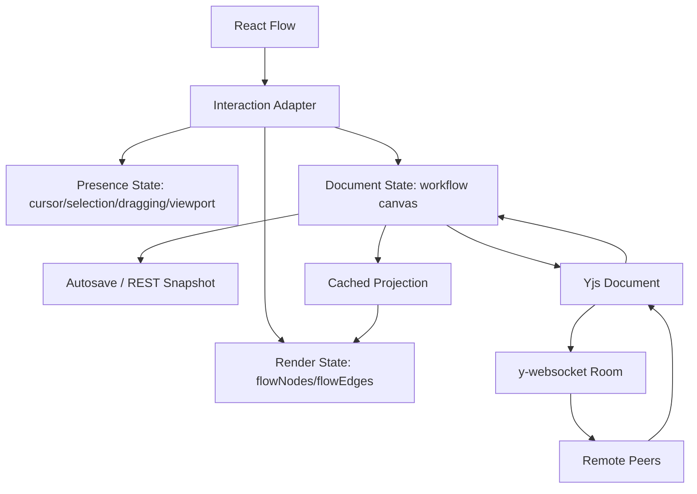

# 技术设计: 工作流画布性能与协作同步重构

## 技术方案

### 核心技术
- React Flow / `@xyflow/react`
- Zustand 或等价本地 store
- TanStack Query
- WebSocket
- Yjs + y-websocket
- 浏览器 Performance / React Profiler

### 官方资料基准
- React Flow Collaborative 示例说明其协作方向为 React Flow + Yjs + y-websocket: https://reactflow.dev/examples/interaction/collaborative
- React Flow Multiplayer 指南强调 realtime 协作需要同步最终动作、拖拽等瞬态状态、用户 presence，并需要可靠冲突合并: https://reactflow.dev/learn/advanced-use/multiplayer
- React Flow Performance 指南强调节点移动会产生高频状态更新，应 memoize 组件/函数/对象，避免组件直接依赖频繁变化的 `nodes`/`edges`: https://reactflow.dev/learn/advanced-use/performance
- React Flow `applyNodeChanges()` 是受控流中应用 `NodeChange[]` 的官方工具: https://reactflow.dev/api-reference/utils/apply-node-changes
- React Flow `<ReactFlow />` 文档说明 `onNodesChange` 会在节点拖拽、选择、移动时调用，`onMove` 会在 pan/zoom 时调用: https://reactflow.dev/api-reference/react-flow
- Yjs document updates 是压缩二进制更新，并且具备可交换、可结合、幂等特性: https://docs.yjs.dev/api/document-updates
- y-websocket 是 Yjs 的 WebSocket provider，支持中心化 server、跨 tab 通信和 awareness 信息交换: https://docs.yjs.dev/ecosystem/connection-provider/y-websocket
- Yjs Awareness 用于在线状态、光标、选区等不需要持久化的 presence 数据: https://docs.yjs.dev/api/about-awareness

## 架构设计



### 状态分层

#### Render State
只服务 React Flow 当前帧渲染。
- 保存 `flowNodes` / `flowEdges`，结构直接符合 React Flow。
- `onNodesChange` 每次都应用 `applyNodeChanges(changes, flowNodes)`。
- 拖拽、selection、dimensions 等高频变更先进入 render state。
- 每次变更只替换真正变化的 flow node/edge 对象，避免所有节点引用重建。

#### Document State
代表 Mina 业务真实数据和可保存 snapshot。
- 保存 workflow name/version、业务节点数据、边、mediaSlots、task config。
- 使用 normalized 结构优先：`nodesById`、`nodeOrder`、`edgesById`、`edgeOrder`。
- 配置变更、增删节点/边、拖拽结束位置、分组关系变更才提交。
- 提交后推进 `draftRevision`，触发 autosave 或 Yjs 文档更新。

#### Presence State
代表不需要持久化的协作 UI 状态。
- 本地 cursor、viewport、selected node ids、正在拖拽的 node ids、拖拽中的实时位置。
- 使用 Yjs awareness 或当前 WS transient channel。
- 不写入 workflow snapshot，不触发 dirty。

#### Sync State
管理保存、WS/Yjs 连接和版本。
- 连接生命周期只依赖 `workflowId`、认证、room URL。
- 本地 dirty/version/selection 用 ref 或 store snapshot 读取，不作为 socket effect 依赖。
- REST autosave 和 Yjs 协作阶段不能同时互相覆盖；需要明确单一提交源。

## 关键链路

### 节点拖拽链路
1. `onNodeDragStart` 记录拖拽基线：node id、起始 position、parentId、尺寸。
2. `onNodesChange` 收到 position changes。
3. render state 使用 `applyNodeChanges` 更新当前帧位置。
4. 如果 `change.dragging === true`：
   - 不推进 `draftRevision`。
   - 不触发 autosave。
   - 最多按 requestAnimationFrame 或 30Hz 推送 presence。
5. `onNodeDragStop` 或 `position` change 的 `dragging === false`：
   - 读取最终 position。
   - 与拖拽基线比较。
   - 若发生变化，向 document state 提交一次 `moveNode` transaction。
   - 推进 `draftRevision` 一次。
   - autosave/Yjs 持久同步按提交事件处理。

### 画布 pan/zoom 链路
1. React Flow 内部 viewport 负责交互帧。
2. 不将 `onMove` 每帧写入业务 store。
3. 如果要恢复用户视口，只在 `onMoveEnd` 写入 UI store 或本地用户偏好。
4. 协作时 viewport 通过 awareness 节流同步，不进入持久 workflow。

### 节点数据投影链路
1. document state 变更后，通过 cached projection 生成 flow node。
2. 单个业务节点变化只重建对应 flow node。
3. `nodeTypes`、`edgeTypes`、handler、snapGrid、defaultEdgeOptions 等稳定引用。
4. 节点组件优先从 `node.data` 读取显示摘要，避免每个节点再通过全量 graph selector 订阅。
5. 对必须订阅 store 的节点，selector 只能订阅当前 node id 对应的窄字段，并保证未变化时返回同一引用。

### 媒体渲染链路
1. 图片节点展示真实静态资源。
2. 图片使用固定容器、稳定 aspect-ratio、`loading="lazy"`、`decoding="async"`、resource id memo。
3. 视频节点只渲染 poster/封面和播放入口。
4. `<video>` 只在详情面板或媒体查看器中按用户动作挂载。
5. 拖拽期间不隐藏图片/封面，不降低画布可读性。

## 协作方案: React Flow + Yjs + y-websocket

### Yjs 文档结构
建议先使用可迁移的 map/array 结构：

```ts
type WorkflowYDoc = {
  nodes: Y.Map<Y.Map<unknown>>
  nodeOrder: Y.Array<string>
  edges: Y.Map<Y.Map<unknown>>
  edgeOrder: Y.Array<string>
  meta: Y.Map<unknown>
}
```

节点字段建议继续区分：
- `position`、`parentId`、`width`、`height`: layout 字段。
- `data.title`、`data.nodeType`、`mediaSlots`、`taskConfig`: 业务字段。
- 大文本字段后续可使用 `Y.Text`。
- 大型媒体对象不进入 Yjs 文档，只保存 media object id/resource id。

### Awareness 数据结构

```ts
type WorkflowAwareness = {
  user: { id: string; name: string; color: string }
  cursor?: { x: number; y: number }
  viewport?: { x: number; y: number; zoom: number }
  selection?: { nodeIds: string[]; edgeIds: string[] }
  dragging?: { nodeIds: string[]; positions: Record<string, { x: number; y: number }> }
}
```

Awareness 不持久化，用于多人光标、远端选区、远端拖拽预览。

### 同步策略
第一阶段不直接替换保存链路：
- Mina REST snapshot 仍是持久化主链路。
- Yjs 作为 shadow sync 或协作实验链路。
- 对比 REST snapshot 与 Yjs 导出 snapshot，确认一致后再切换。

第二阶段切换到协作主链路：
- 本地 document transaction 写入 Yjs。
- y-websocket 分发 update。
- 后端持久化 Yjs updates 和周期性 snapshot。
- REST `saveWorkflow` 可保留为导出/兼容接口，或由 Yjs snapshot 生成。

### 冲突策略
- 节点新增：client-generated id，Y.Map 幂等写入。
- 节点删除：删除节点时同时删除关联边；远端如果更新已删除节点，忽略或转入 tombstone 检查。
- 节点位置：拖拽中走 awareness；拖拽结束写 Yjs document。冲突时最后提交者覆盖 layout 字段，但 UI 上通过远端拖拽 presence 避免误解。
- 配置字段：普通字段使用 Y.Map；长文本使用 Y.Text；mediaSlots 使用稳定 item id + order。
- 同节点多人编辑：先做 presence 提示和软锁，不强制阻断用户操作。

## 架构决策 ADR

### ADR-001: 采用三层状态模型
**上下文:** 当前卡顿来自高频交互、业务保存、WS 同步和节点组件渲染共享状态链路。
**决策:** 拆分 render state、document state、presence state。
**理由:** React Flow 的交互帧需要即时更新；业务保存只需要语义完成后的提交；协作 presence 不应污染持久文档。
**替代方案:** 所有变化都写一个 Zustand graph store -> 拒绝原因: 拖拽每帧会触发全链路副作用和全量订阅。
**影响:** 需要新增 adapter 和 transaction 层，但可以同时保证流畅度、保存正确性和协作能力。

### ADR-002: 保持受控 React Flow，但正确应用 NodeChange
**上下文:** Mina 需要保存、协作、节点业务数据和 React Flow 状态联动，完全 uncontrolled 会让业务状态同步复杂。
**决策:** React Flow 继续受控，但 render state 使用 `applyNodeChanges` 处理所有 NodeChange。
**理由:** 官方受控流示例和 API 均以 `applyNodeChanges` 作为基础语义；跳过拖拽中的 position change 会造成外部 nodes prop 与内部拖拽状态冲突。
**替代方案:** 拖拽中不更新外部 nodes，只在 stop 写入 -> 拒绝原因: 已经复现卡顿和状态冲突。
**影响:** 拖拽流畅；需要将 dirty 提交从 frame update 中拆出来。

### ADR-003: Yjs 作为协作冲突合并引擎
**上下文:** 手写 WebSocket 多人编辑需要处理乱序、断线、重连、冲突和 presence。
**决策:** 协作阶段采用 Yjs + y-websocket。
**理由:** React Flow 官方协作示例选择 Yjs/y-websocket；Yjs update 具备可交换、可结合、幂等属性，适合多人编辑状态合并。
**替代方案:** 手写 WS patch + version compare -> 拒绝原因: 冲突和离线恢复边界复杂，容易出现丢更新。
**影响:** 需要新增 Yjs 文档模型、后端 room/persistence、snapshot 迁移和权限控制。

## API设计

### 保留 REST 保存
`PUT /api/workflows/:workflowId`
- **请求:** workflow snapshot，包括 version、nodes、edges、name。
- **响应:** 最新 workflow version。
- **用途:** 阶段 1-3 继续作为主保存链路。

### 新增 Yjs WebSocket room
`WS /api/workflows/:workflowId/collab`
- **认证:** 复用现有 session/cookie。
- **room:** `workflow:${workflowId}`。
- **消息:** y-websocket protocol。
- **用途:** 阶段 5 协作同步。

### 新增 Yjs snapshot/export
`GET /api/workflows/:workflowId/collab/snapshot`
- **响应:** 从 Yjs 文档导出的 workflow canvas snapshot。
- **用途:** 对账、迁移、服务端渲染或导出。

## 数据模型

阶段 1-4 不强制改数据库，只调整前端状态模型。

阶段 5 可新增：

```sql
CREATE TABLE workflow_yjs_updates (
  id TEXT PRIMARY KEY,
  workflow_id TEXT NOT NULL,
  update_bin BLOB NOT NULL,
  created_at TIMESTAMP NOT NULL
);

CREATE TABLE workflow_yjs_snapshots (
  workflow_id TEXT PRIMARY KEY,
  state_vector BLOB NOT NULL,
  snapshot_bin BLOB NOT NULL,
  version INTEGER NOT NULL,
  updated_at TIMESTAMP NOT NULL
);
```

## 安全与性能

### 安全
- y-websocket room 必须按 workflow 权限鉴权。
- 服务端不能接受跨 workflow room 订阅。
- Awareness 中不放敏感 token、完整任务配置或私密资源 URL。
- Yjs update 持久化需限制大小和频率，避免异常客户端写入过量数据。

### 性能
- 拖拽中不触发 autosave、不写 REST、不广播持久 patch。
- presence 采用 requestAnimationFrame 或 30Hz 上限。
- 节点投影按 id 缓存，避免 `nodes.map(toFlowNode)` 每帧重建所有对象。
- 节点组件 `memo`，handler/object/array prop 稳定。
- 避免组件直接订阅全量 `nodes`/`edges`。
- `onlyRenderVisibleElements` 只在节点数量超过阈值后按实测启用，因为官方说明它可能提升大量元素性能，也会带来额外开销。
- 图片静态渲染保留；视频使用 poster，避免画布内大量 `<video>` 解码。

## 测试与部署

### 性能验证
- 建立 20/100/500 节点 fixture。
- Chrome Performance 记录节点拖拽、画布 pan、缩放、选择、保存。
- React Profiler 检查拖拽时节点组件 render 次数。
- 记录 `onNodesChange` 次数、document commit 次数、autosave 次数、WS/Yjs 消息次数。

### 功能验证
- 拖拽节点后自动保存。
- 新建/删除节点和边后自动保存。
- 刷新页面后位置一致。
- WebSocket 不因 dirty/selection 改变重连。
- 图片节点仍可见。
- 视频节点只展示 poster，打开查看器后再播放。

### 协作验证
- 双 tab 同 workflow。
- A 拖拽中 B 看到 presence/远端拖拽态。
- A 拖拽结束 B 收到最终 position。
- A 断网编辑、恢复连接后文档合并。
- 同一节点并发移动和配置编辑不会破坏文档结构。
