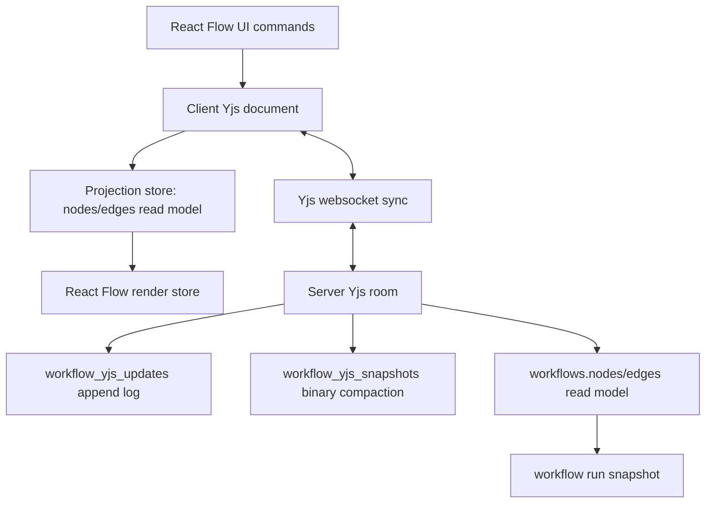

# 技术设计: Workflow Canvas Yjs 单一事实源重构

## 技术方案

### 核心技术
- React + Zustand + React Flow 仍用于 UI 和渲染。
- Yjs 作为 workflow graph 的唯一事实源和 op log。
- `y-websocket` 协议继续使用，但服务端实现需要补齐 sync step 持久化、ack 和 compaction 语义。
- PostgreSQL `workflow_yjs_snapshots` / `workflow_yjs_updates` 作为 durable collaboration state。

### 实现要点
- 前端不再维护 `documentTransactions`、`draftRevision`、`savedRevision` 作为图状态提交依据。
- UI mutation action 改为 thin command：直接操作 `WorkflowYDocHandles`。
- Zustand 保留为 UI/read projection：selection、panel、runtime、render cache、save status 可以保留；图状态 `nodes/edges` 由 ydoc observe 单向刷新。
- 服务端不把 checkpoint 返回的 plain snapshot 再导回 client ydoc。
- `workflows.nodes/edges` 降级为 read model，由 server ydoc 导出更新；运行前使用 server ydoc 最新导出。

## 架构设计



## 架构决策 ADR

### ADR-001: Yjs document 是画布协作唯一事实源
**上下文:** 当前 Zustand store、Yjs shadow doc、REST checkpoint、DB definition 都能覆盖图状态，导致循环同步和并发丢失。  
**决策:** workflow graph 的权威状态只存在于 Yjs document；其他状态只能是投影或持久化 read model。  
**理由:** CRDT 协作必须保证单一事实源和单向因果，否则同一编辑会被翻译并广播多次。  
**替代方案:** REST + 乐观锁 + WS invalidation → 拒绝原因: 无法满足实时多端协作体验。  
**影响:** 需要重写前端 mutation、保存状态、服务端 checkpoint 语义和测试。

### ADR-002: 删除前端 full snapshot 回写 ydoc
**上下文:** `importWorkflowSnapshotToYjs` 使用 `clear + set`，保存成功后会把服务端返回 snapshot 变成新的本地 Yjs update 并广播。  
**决策:** 前端只在创建空 ydoc 或测试 fixture 时允许导入 plain snapshot；运行时禁止 ydoc -> snapshot -> ydoc 循环。  
**理由:** 这条路径是节点复原、远端覆盖和空画布的核心来源。  
**替代方案:** 保留 full import 但增加 guard → 拒绝原因: 仍然保留双事实源和广播回声风险。  
**影响:** `reconcileLiveWorkflowYjsSnapshot`、`applyRemoteSnapshot(source: 'yjs')` 的图状态路径需要删除。

### ADR-003: 服务端 checkpoint 只做 compaction/read-model 更新
**上下文:** 现在 checkpoint 接收 client `encodeStateAsUpdate`，应用到 room，导出 plain snapshot 写 definition，再返回给 client。  
**决策:** checkpoint 不再接受客户端整包状态作为保存主路径；服务端按已接收 Yjs update 做 binary snapshot compaction，并更新 `workflows.nodes/edges` read model。  
**理由:** 客户端状态同步应走 Yjs sync 协议，checkpoint 不应作为第二条数据通道。  
**替代方案:** checkpoint 加 expectedVersion 后继续全量提交 → 拒绝原因: 仍会与 Yjs sync 通道竞争。  
**影响:** API contract、autosave hook、运行前保存逻辑需要调整。

## API设计

### GET /api/workflows/:id/collab/:room
- **用途:** 唯一实时同步通道。
- **请求:** Yjs sync/awareness binary message。
- **响应:** Yjs sync/awareness binary message。
- **要求:** 对所有会修改 server ydoc 的 sync message 进行持久化；广播排除 sender；拒绝超限 update；graph schema 在客户端 command dry-run 和服务端 checkpoint 阶段校验。

### POST /api/workflows/:id/collab/checkpoint
- **用途:** 服务端 compaction 和 read model 刷新。
- **请求:** `{ name?: string }`，不再传 `stateUpdate`。
- **响应:** `{ item: Workflow, yjsStateVector: number[] }`。
- **行为:** 从 server room ydoc 导出 snapshot，执行 `validateCanvas`，写 `workflow_yjs_snapshots`，更新 `workflows.nodes/edges` read model。

### GET /api/workflows/:id/collab/snapshot
- **用途:** 初始化和诊断。正常 client 以 WS sync 为准。
- **响应:** 可保留 plain snapshot，但前端不能把它写回已有 ydoc。

## 数据模型

现有表可继续使用：

```sql
workflow_yjs_updates(workflow_id, update_bin, created_at)
workflow_yjs_snapshots(workflow_id, state_vector, snapshot_bin, version, updated_at)
```

新增或调整建议：
- `workflow_yjs_updates` 增加顺序字段或使用单调 `created_at + id` 排序，避免同毫秒写入排序不稳定。
- `workflow_yjs_snapshots` 的 `version` 表示 Yjs snapshot generation，不再强行与 `workflows.version` 混用。
- `workflows.version` 表示 read model/run snapshot 版本；由 server ydoc 导出时递增。

## 前端重构细节

### 1. 新建 Yjs document store
- 新建 `sync/yjs/workflow-yjs-store.ts` 或等价模块，管理当前 workflow 的 `ydoc`、provider、connection status、last acked state vector。
- 暴露 command API：`moveNodes`、`upsertNode`、`updateNodeConfig`、`connectMediaSlot`、`removeNodes`、`removeEdges`。
- command API 直接写 Yjs，不写 Zustand graph state。

### 2. 投影层单向同步
- ydoc observe/observeDeep 后导出 `nodes/edges`，写入 projection store。
- projection store 替代当前 `hydrateFromServer/applyRemoteSnapshot` 的协作图职责。
- render store 继续从 projection store hydrate React Flow nodes/edges。

### 3. 拆细 Yjs 数据结构
- `nodeOrder: Y.Array<string>`
- `edgeOrder: Y.Array<string>`
- `nodes: Y.Map<Y.Map | object>`，逐步从 object value 迁移到 nested structure。
- `nodeFrames: Y.Map<Frame>` 保留位置/尺寸，作为拖拽高频字段。
- `nodeConfigs` / `mediaSlots` 后续拆成 nested Y.Map/Y.Array；第一阶段至少避免 `update_node` 覆盖 `nodeFrames`。

### 4. 移除旧循环路径
- 删除或停止生产调用：`documentTransactions`、`appliedTransactionRevisions`、`flushPendingLocalTransactionsToYjs`、`reconcileLiveWorkflowYjsSnapshot`。
- `use-workflow-autosave` 改为保存状态/compaction hook，不再提交 full graph。
- `WorkflowCanvasPage` 不因 `workflow.definition.updated` 对协作图执行 REST hydrate。

## 后端重构细节

### 1. 修正 Yjs sync message 持久化
- `messageYjsUpdate` 已持久化并广播。
- `messageYjsSyncStep2` 如果携带客户端缺失 update，不能只 apply 到内存；需要提取 update 并持久化/广播，或改用标准 y-websocket server 行为监听 doc update 并统一处理。

### 2. 增加 schema validation
- 客户端 command 层对克隆 ydoc 执行 dry-run，导出 snapshot 后使用 graph validator 校验，校验通过才写 live ydoc。
- 服务端不再对每条 Yjs update 执行 O(N) 全量 clone/export 校验；checkpoint/read-model refresh 时导出 server ydoc 并使用 `validateCanvas` 校验。
- 校验失败时 checkpoint 失败，不能写 compacted snapshot 或 workflow read model。

### 3. Compaction 与 read model
- room 收到 update 后 append log。
- 达到阈值或 checkpoint 时写 binary snapshot。
- checkpoint/read-model 更新从 server ydoc 导出最新 plain graph，调用 workflow definition repository 更新 `workflows.nodes/edges`。
- 避免 checkpoint 与 update 持久化并发造成版本乱序，按 workflowId 串行化关键区。

## 安全与性能
- **权限:** 所有 collab WS/REST 继续通过 account auth 校验，room id 必须等于 workflow id。
- **输入:** update size limit 保留；客户端 command dry-run 校验和 checkpoint 导出 snapshot schema 校验保留。
- **持久化:** update append 必须在广播前完成，防止其他 client 已看到但服务端重启丢失。
- **性能:** 拖拽过程中可以只发 awareness/ephemeral preview，drag stop 再提交 Yjs frame update；避免每个 pointer move 持久化。
- **清理:** room idle cleanup 只能销毁内存，不影响 binary snapshot/update log。重建必须从 snapshot + ordered updates 恢复。

## 测试与部署
- **单元测试:** ydoc command、projection export、schema validation。
- **前端集成测试:** 两个 browser context 同账户同 workflow，拖拽、编辑、保存状态、重连。
- **后端集成测试:** 多 WS client、sync step2 持久化、checkpoint compaction、service restart restore。
- **迁移验证:** 旧 `workflows.nodes/edges` 初始化新 ydoc；旧 Yjs flat map snapshot 兼容读取。
- **部署:** 开发阶段直接移除 disabled/legacy 分支和 `workflowCanvasSyncMode` 配置，只保留 Yjs SSOT 协作路径。
