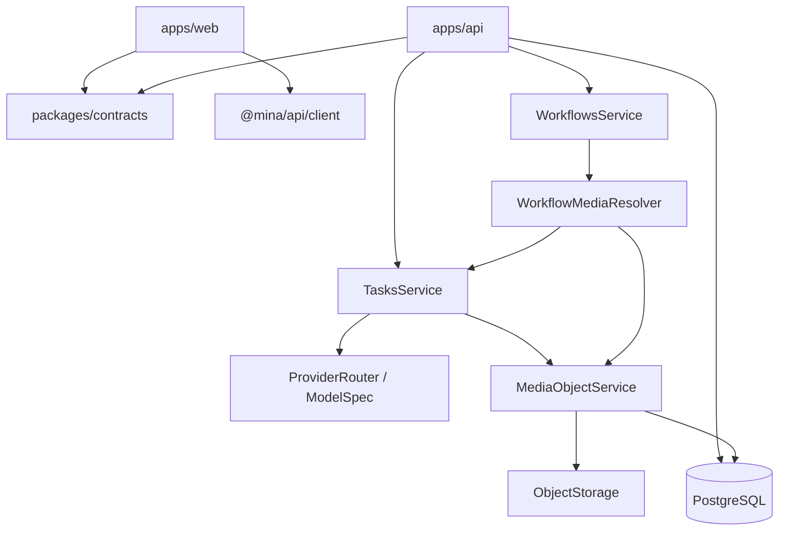
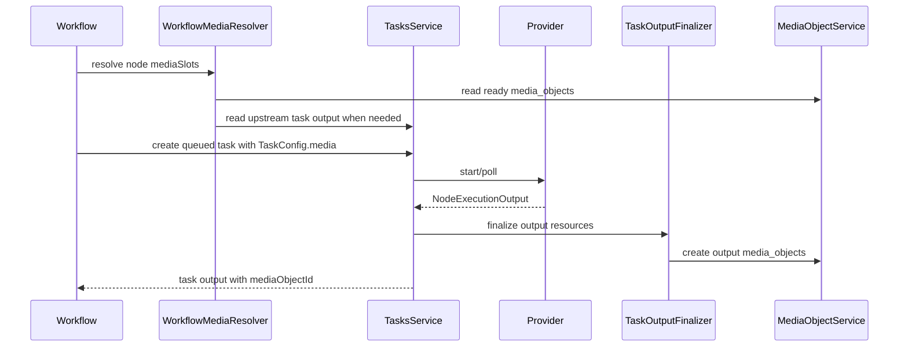
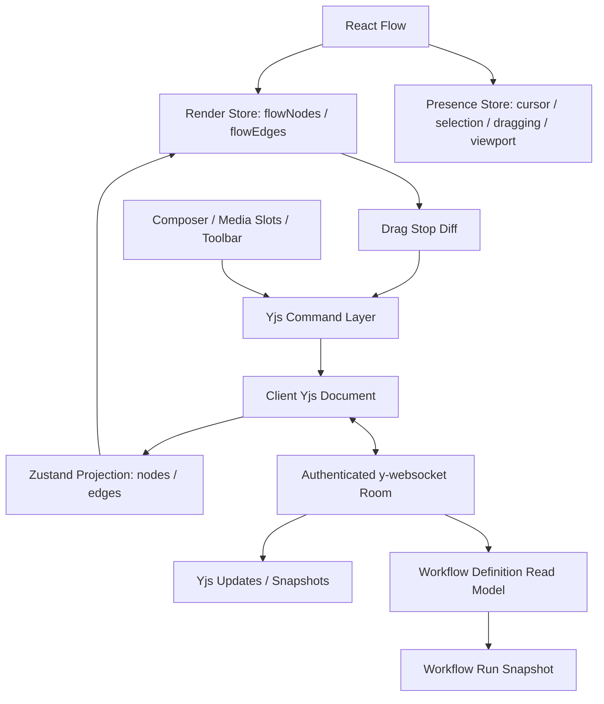
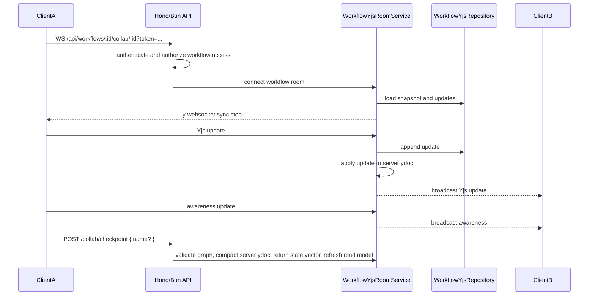

# Architecture

## System Shape

## Key Decisions
| ID | Decision | Status | Modules |
| --- | --- | --- | --- |
| ADR-MEDIA-001 | Store file entities in `media_objects`; workflow/task records store references and snapshots. | Accepted | Media, Tasks, Workflows |
| ADR-WF-001 | Own media input order in target node `data.mediaSlots`, not in edge order. | Accepted | Workflows |
| ADR-TASK-001 | Mirror provider outputs through a shared `TaskOutputFinalizer`, not provider-specific storage code. | Accepted | Tasks, Media |
| ADR-DATA-001 | Use PostgreSQL-backed Drizzle repositories for application business runtime; keep fakes only in tests. | Accepted | API |
| ADR-WEB-001 | Keep the browser-sized app shell in the TanStack root layout; route pages render only inside the stable route frame. | Accepted | Web |
| ADR-WEB-002 | Gate unauthenticated browser usage at the app provider layer with a centered password login/register card, typed Hono RPC calls, and contract-parsed responses. | Accepted | Web, Auth |
| ADR-WF-002 | Split workflow canvas render state from persisted document projection; React Flow interaction frames update render state while graph commits write Yjs. | Accepted | Web, Workflows |
| ADR-WF-003 | Use Yjs as the workflow canvas graph single source of truth; REST workflow definitions are read models. | Accepted | Web, API, Workflows |
| ADR-WF-004 | Collaboration checkpoints perform server-side Yjs compaction and read-model refresh only; clients do not upload full graph state. | Accepted | Web, API, Workflows |

## Runtime Flow

## Workflow Canvas State Flow

## Workflow Collaboration Flow

